<h1 align="center">Hello there, Nebby here.</h1>

<h3 align="center">I'm currently majoring in Software Engineering at University of Information Technology.</h3>

    
<h2 align="center">✦ About Me ✦</h2>

I'm mainly a hobbyist programmer, specializing in web development. Always trying to find new stuff and technologies to learn and adapt to the ever-changing tech industry nowadays. Love to work with great teammates.

I mostly work with TypeScript, but can also make things with various other languages - including Python, C#, etc...

Currently in the job finding arc, and wow it is hard 

<h2 align="center">✦ Github Stats ✦</h2>

 

<h2 align="center">✦ Personal Hobbies ✦</h2>

 